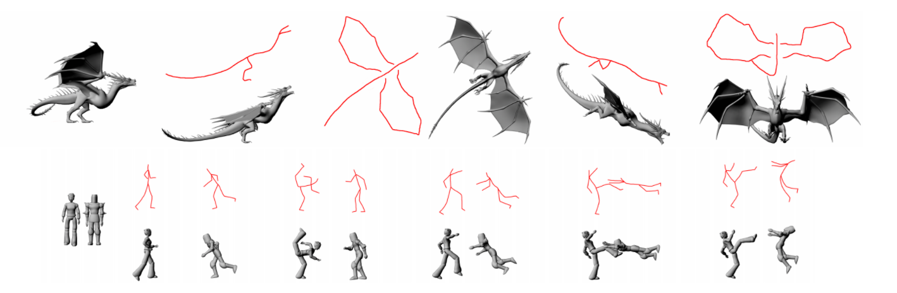

Sketch as the most intuitive and powerful 2D design method has been used by artists for decades. However it is not fully integrated into current 3D animation pipeline as the difficulties of interpreting 2D line drawing into 3D. Several successful research for character posing from sketch has been presented in the past few years, such as the Line of Action [Guay et al. 2013] and Sketch Abstractions [Hahn et al. 2015]. However both of the methods require animators to manually give some initial setup to solve the corresponding problems. In this paper, we propose a new sketch based character posing system which is more flexible and efficient. It requires less input from the user than the system from [Hahn et al. 2015]. The character can be easily posed no matter the sketch represents a skeleton structure or shape contours.

Recommended citation: Barbieri, Simone, et al. "Enhancing character posing by a sketch-based interaction." <i>ACM SIGGRAPH 2016 Posters. ACM, 2016.</i>