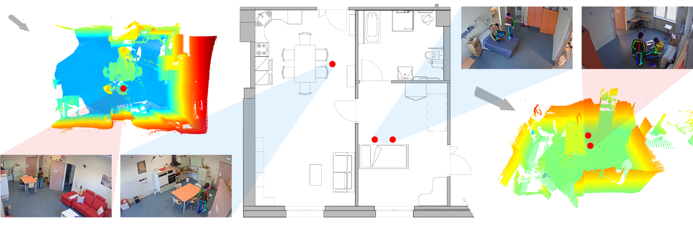

Living labs are spaces where public and private stakeholders work together to develop and prototype new products, technologies and services in real environments embedded in the community or market place. This paper outlines the approach chosen by AUSILIA (Assisted Unit for Simulating Independent Living Activities), a living lab established in Provincia Autonoma di Trento in 2016 to develop an innovation model for taking care of the elderly or disabled patient by fusion of technology innovation and patient centered integrated care approach. AUSILIA goal is triple: i. to provide an innovative framework based on augmented virtual reality for occupational therapy in ageing and fragile individuals; ii. to help people who are losing autonomy and independence living at home reducing care burden; iii. warrant continuous innovation through the mixed contribution of the academy and private enterprise. The paper describes the specific solutions adopted for the three objectives, reporting an implementation example for each of them.

Recommended citation: Grisenti, Andrea, et al. "Technological Infrastructure supports new paradigm of care for healthy aging: The Living Lab Ausilia." <i>10 Forum Italiano Ambient Assisted Living, 19-21 Giugno 2019, Ancona, Italia</i>