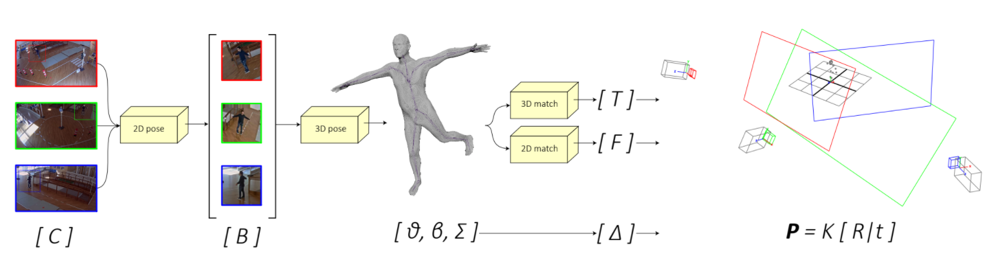

Camera resectioning is essential in computer vision and 3D reconstruction to estimate the position of matching pinhole cameras in 3D worlds. While the internal camera parameters are usually known or can be easily computed offline, in camera networks extrinsic parameters need to be computed each time a camera changes position, thus not allowing for smooth and dynamic network reconfiguration. In this work we propose a fully markerless, unsupervised, and automatic tool for the estimation of the extrinsic parameters of a camera network, based on 3D human mesh recovery from RGB videos. We show how it is possible to retrieve, from monocular images and with just a weak prior knowledge of the intrinsic parameters, the real-world position of the cameras in the network, together with the floor plane. Our solution also works with a single RGB camera and allows the user to dynamically add, re-position, or remove cameras from the network.