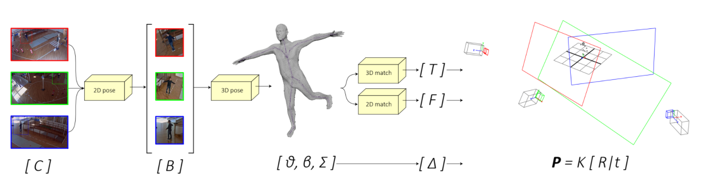

Camera calibration is a necessary preliminary step in computer vision for the estimation of the position of objects in the 3D world. Despite the intrinsic camera parameters can be easily computed ofine, extrinsic parameters need to be computed each time a camera changes its position, thus not allowing for fast and dynamic network re-confguration. In this paper we present an unsupervised and automatic framework for the estimation of the extrinsic parameters of a camera network, which leverages on optimised 3D human mesh recovery from a single image, and which does not require the use of additional markers. We show how it is possible to retrieve the real-world position of the cameras in the network together with the foor plane, exploiting regular RGB images and with a weak prior knowledge of the internal parameters. Our framework can also work with a single camera and in real-time, allowing the user to add, re-position, or remove cameras from the network in a dynamic fashion.