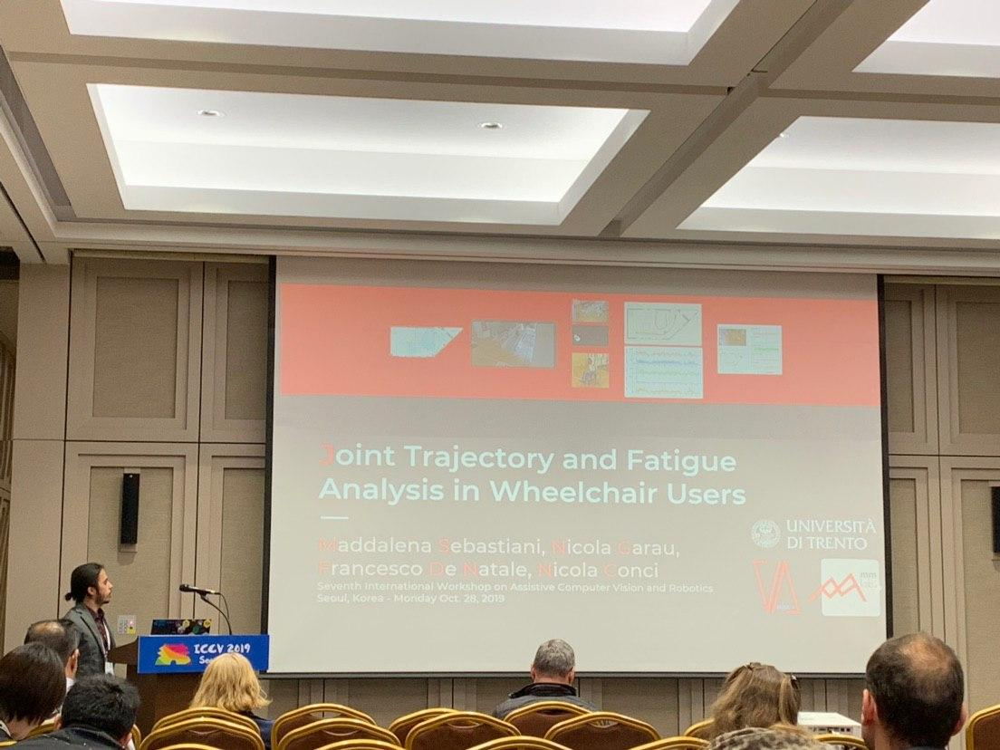

A successful rehabilitation process always requires both medical and infrastructural support. In this paper we focus on paraplegic wheelchair users, aiming at understanding the correlation between accuracy in guidance and muscular fatigue, while moving on a known training path.

Format: 